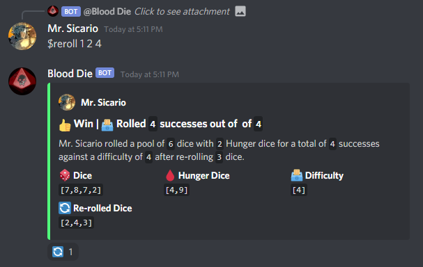

#  Blood Die

## *A Discord bot for Vampire the Masquerade V5.*

Made with the [Discord.JS][Discord.js docs] and [Commando API][Commando docs].

[Discord.js docs]: https://discord.js.org/#/docs/main/stable/general/welcome
[Commando docs]: https://discord.js.org/#/docs/commando/master/general/welcome

---

## :desktop_computer: Installation

Click [this][0] link to add the bot to your server.

[0]: https://discord.com/api/oauth2/authorize?client_id=843168753759944744&permissions=116800&scope=bot

## :heavy_dollar_sign: Commands

Blood Die expands on the [default commands][1] provided by Discord.JS and Commando.

The bot uses reactions to read and write data, so eliminating the bot's automatic reactions is a sure-fire way to break the bot.

#### Notation

`:prefix:command [name_of_the_argument:default_value]`

[1]: https://discord.js.org/#/docs/commando/master/commands/builtins

#### Prefix

The default prefix of the bot is `$`, but can be changed using the default `prefix` command on a server by server basis.

### :black_small_square: :ballot_box: Roll

The `roll` command is the heart and soul of Blood Die and has three optional arguments: total dice of the pool, the amount of Hunger dice to replace regular dice with, and the difficulty of the roll.

#### Syntax

`$roll [total_dice:1] [hunger_dice:0] [difficulty:'']`

`[total_dice:1]` Takes an int as the total amount of dice to roll.

`[hunger_dice:0]` Takes an int as the amount of hunger dice to roll.

`[difficulty:'']` Takes an int as the difficulty of the roll.

#### Aliases

`$r [total_dice:1] [hunger_dice:0] [difficulty:'']`

#### Example

### :black_small_square: :arrows_counterclockwise: Reroll

The `reroll` command __requires__ the user to reply to the original roll and provide up to three indexes of the dice to be re-rolled. The command will also mark both the original roll and the re-roll with a :arrows_counterclockwise: reaction to prevent further re-rolls*. Only the original caller of a roll can call the re-roll of a given roll.

The command takes the *natural* index, i.e. the first die has to be accessed with 1 and so on.

#### Syntax

`$reroll [index1:1] [index2:''] [index3:'']`

`[index1:1]` Takes the index of the first dice to be rerolled.

`[index2:'']` Takes the index of the second dice to be rerolled.

`[index3:'']` Takes the index of the third dice to be rerolled.

#### Aliases

`$rr [index1:1] [index2:''] [index3:'']`

#### Example

>___*Note:___ _You_ can _delete the reactions to allow further rerolls but this isn't the intended use of the bot and can't guarantee proper results._

### :black_small_square: :thumbsup:/:drop_of_blood: Check

The `check` command rolls a single die by default and _checks_ whether the caller passed or not. If you send an argument, the bot will roll that many  dice and if any dice is a success (6 or more) the check is a success.

#### Syntax

`$check [total_dice:1]`

`[total_dice:1]` The amount of dice to be rolled for the check.

#### Aliases

`$c [total_dice:1]`

`$rouse [total_dice:1]`

#### Example

>___Note:___ _Using the_ :arrows_counterclockwise: _Reroll command to reroll output of the check command will cause an error, so the bot marks the embed with either a_ :thumbsup: _or a_ :drop_of_blood: _reaction to prevent this._

### :black_small_square: :skull: Oblivion

This command is a _"fork"_ of check and functions the same way but on rolls of 1 or 10 the sent embed will note that the roll can result on a Stain on the caller's Humanity.

#### Syntax

`$oblivion [total_dice:1]`

`[total_dice:1]` The amount of dice to be rolled for the check.

#### Aliases

`$o [total_dice:1]`

#### Example

>___Note:___ _Using the_ :arrows_counterclockwise: _Reroll command to reroll output of the oblivion command will cause an error, so the bot marks the embed with either a_ :thumbsup: _or a_ :drop_of_blood: _reaction to prevent this._

### :black_small_square: :game_die: Dice

A regular dice roll command, taking common dice notation as input.
The bot will mark the embed with a :arrows_counterclockwise: reaction that if the original caller clicks within 20 seconds, the bot will re-roll the same common dice notation.

#### Syntax

`$dice [expression]`

`[expression]` The dice to be rolled in regular dice notation.

#### Aliases

`$d [expression]`

#### Example

>___Note:___ _Using the_ :arrows_counterclockwise: _Reroll command to reroll output of the dice command will cause an error, so the bot marks the embed with a_ :game_die: _reaction to prevent this._

### :black_small_square: :coin: Cointoss

Toss a coin ~~to your Witcher.~~ A simple command to toss a coin and get either heads or tails. Similarly to the Dice command, reacting to the embed with :arrows_counterclockwise: will toss a new coin.

You can also use the :coin: emoji to call the command.

#### Syntax

`$cointoss`

#### Aliases

`$ct`

`$toss`

`$:coin:`

#### Example

>___Note:___ _Using the_ :arrows_counterclockwise: _Reroll command to reroll output of the cointoss command will cause an error, so the bot marks the embed with a_ :coin: _reaction to prevent this._

## Dependencies
- [Discord.js](https://github.com/discordjs/discord.js)
- [Commando](https://github.com/discordjs/Commando#readme)
- [roll](https://github.com/troygoode/node-roll)